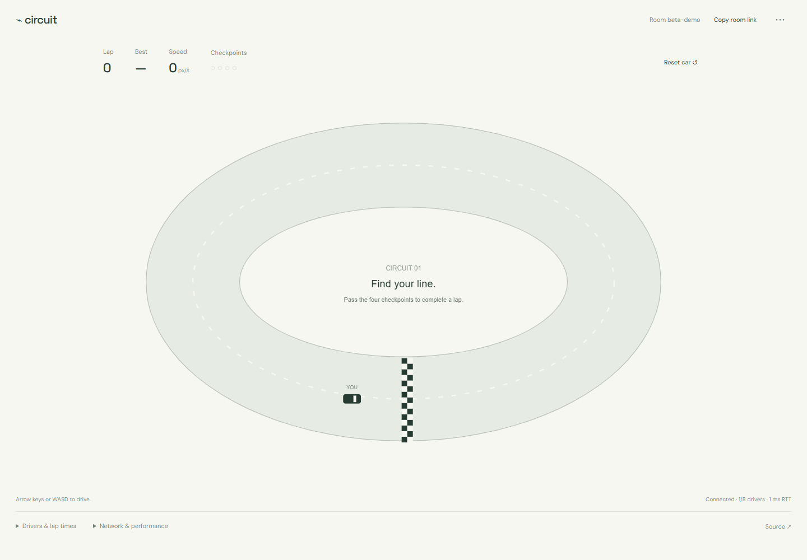

# Circuit · multiplayer-racer

A browser time-trial racer with an authoritative Go simulation and immediate local controls.

[](https://github.com/A-Mardi/multiplayer-racer/actions/workflows/build.yml)

**Working local beta · 0.1.0.** Go, React, and TypeScript.



## What works

- Shared rooms for up to eight drivers, keyboard/touch controls, checkpoints, and lap times.
- A 30 Hz authoritative server; clients submit controls rather than positions.
- Local prediction, acknowledgement-based reconciliation, and remote-car interpolation.
- Reconnect tokens, measured ping, render diagnostics, and selectable added network delay.

## Run

Requires Node.js 22.12+ and Go 1.26+. From the repository root:

```sh
npm ci --prefix web
npm run build --prefix web
node scripts/start.mjs
```

Open http://127.0.0.1:8093. The launcher builds Go and serves the frontend from one origin. Set GO_BINARY if Go is not on PATH. You can pass `--addr`, `--web` to the launcher.

Open a room in two tabs. Drive with arrow keys or WASD, follow the track counterclockwise, and pass the checkpoint gates to record a lap. Open Network & performance to add 200 ms of round-trip delay, then reload to exercise reconnect.

For frontend development, leave the service running and use `npm run dev --prefix web` at http://127.0.0.1:5179; Vite proxies the service routes.

## Verify

```sh
go -C server test ./...
go -C server vet ./...
npm run build --prefix web
npx --prefix web playwright install chromium
npm test --prefix web
```

Browser tests launch an isolated service and temporary data directory. CI additionally runs Go's race detector. Go tests check acceleration, steering, grass drag, and long-run finite bounded state. Playwright connects two drivers, drives, reloads without duplicating the seat, adds 200 ms of RTT, and checks mobile overflow. The eight-driver load result and its limits are recorded in [BENCHMARKS.md](docs/BENCHMARKS.md).

## Beta boundaries

One track with ghost cars: there are no car-to-car collisions, matchmaking, accounts, persistent leaderboards, or 3D rendering. Graphics use Canvas 2D, not Three.js. Rooms support eight drivers and the process caps rooms at 32; only the eight-client single-room case has been measured. Disconnected seats persist for 60 seconds. Reconnect tokens are stored in sessionStorage, so separate tabs get separate drivers. Rooms and results disappear on server restart. The default listener is local; public hosting needs access controls, rate limits, HTTPS, and operational testing.

## Engineering notes

[Architecture](docs/ARCHITECTURE.md) explains the boundaries and tradeoffs. [Roadmap](docs/ROADMAP.md) separates implemented features from future work. [Contributing](CONTRIBUTING.md) covers checks and reproducible reports.

## License

[MIT](LICENSE). Dependency licenses remain their own; see [third-party notices](THIRD_PARTY_NOTICES.md).

### Spectator mode

Open Room settings, choose Spectator, and join. Spectators receive live interpolated cars and lap standings without allocating a driver seat. Copy spectator link shares that view (room URL with watch=1 in its fragment). Each room permits up to 16 spectators separately from its eight drivers; this is a configured limit, not a new capacity benchmark. Spectator input/reset messages are ignored by the server. Switching back to Driver uses an available seat or reclaims this tab's reconnect token; leaving a driver seat still keeps its existing 60-second reconnect grace period.
